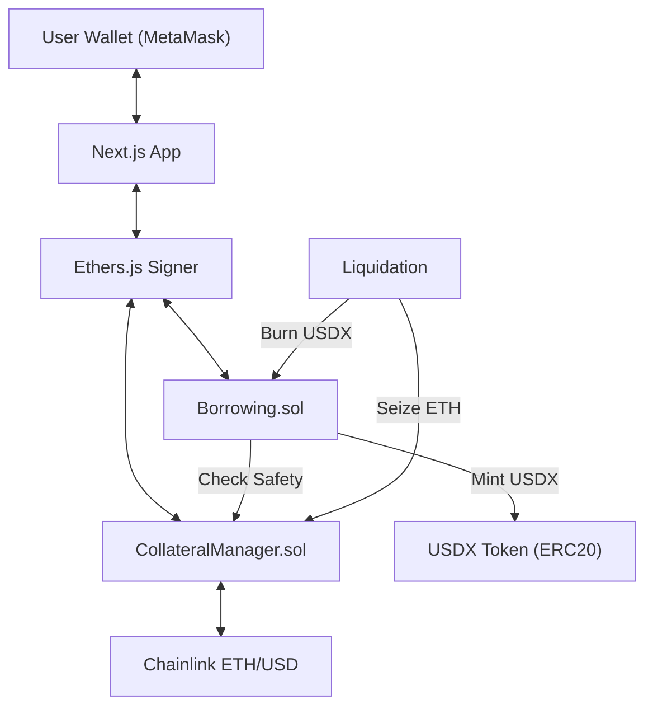

# FluxLend Technical Architecture

FluxLend is a decentralized lending protocol built on **Ethereum Sepolia**. This document outlines the technical layers and how they interact.

---

## 1. Blockchain Layer (Solidity)
The core logic resides in smart contracts compiled and deployed using **Hardhat**.

### Core Contracts
- **`CollateralManager.sol`**: 
  - **Role**: The "Brain" of the protocol's safety.
  - **Function**: Manages ETH deposits, tracks collateral balances, and calculates the **Health Factor** of every user.
  - **Integrations**: Uses **Chainlink AggregatorV3** for real-time ETH/USD price discovery.
- **`Borrowing.sol`**:
  - **Role**: The "Treasury" and "Lender".
  - **Function**: Issues `USDX` (Synthetic Stablecoin) to users based on their collateral value (80% LTV).
  - **Connection**: Queries `CollateralManager` before allowing any borrow or collateral withdrawal.
- **`Liquidation.sol`**:
  - **Role**: The "Enforcer".
  - **Function**: Provides a public interface for liquidating positions where Health Factor < 1.0. 
  - **Connection**: Seizes ETH from `CollateralManager` and gives it to liquidators who repay debt.
- **`MockStablecoin.sol`**:
  - **Role**: The "Currency".
  - **Function**: An ERC20 implementation for the `USDX` token.

---

## 2. Frontend Layer (Next.js)
Built with **React**, **Next.js 15 (App Router)**, and **TypeScript**.

### Infrastructure
- **`Web3Context.js`**: A global React Context that initializes `ethers.js`. It detects the user's wallet (MetaMask), handles Sepolia network switching, and provides the `signer` to the rest of the app.
- **`useContracts.js`**: A custom hook architecture. It maps `CONTRACT_ADDRESSES` and `ABIs` to live contract instances, providing high-level async functions like `fetchUserData()` and `fetchBorrowingPower()`.
- **`AppShell.js`**: The layout router. It intelligently switches between the **Immersive Landing Page** (no sidebar) and the **DApp Environment** (sidebar/topnav).

### UI & Styling
- **Tailwind CSS v4**: Modern, CSS-first styling.
- **Shadcn UI**: Primitives like `Card`, `Button`, and `Sidebar` for a consistent look.
- **Motion (Framer)**: Subtle micro-animations and the global `BeamsBackground` canvas animation.

---

## 3. Data Flow (What connects to What)

---

## 4. Tech Stack Summary
- **Language**: Solidity (Backend), TypeScript/JavaScript (Frontend).
- **Tools**: Hardhat, Ethers.js, Lucide Icons.
- **Visuals**: Spline (3D), Framer Motion, HTML5 Canvas.
- **Network**: Ethereum Sepolia Testnet.
